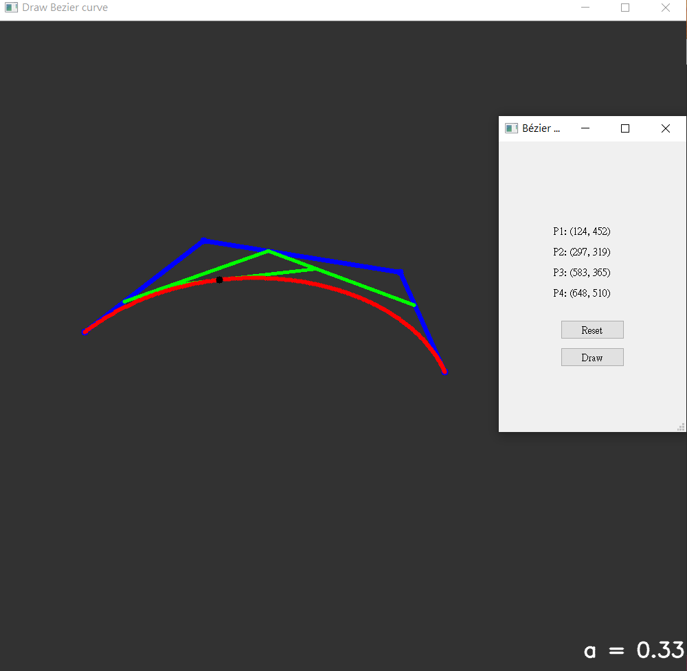

# Environment
- Python 3.7.1
- pip 20.3.3
- numpy 0.19.2
- opencv 3.4.1
- pyqt 5.9.2

# Description
Use the closed form equation to draw cubic Bezier curve:
P(t) = P0*B0(t) + P1*B1(t) + P2*B2(t) + P3*B3(t)

where
B0(t) = (1-t)^3, B1(t) = 3t(1-t)^2, B2(t) = 3t^2(1-t), B3(t) = t^3

# Demo

